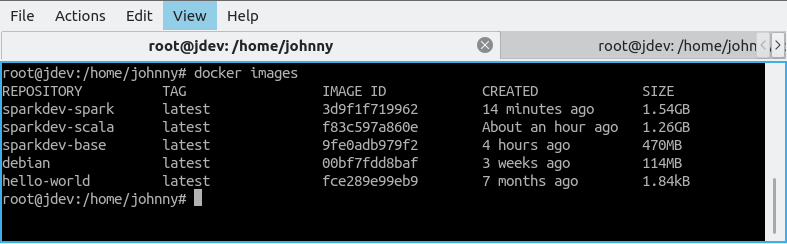

# Apache Spark Development Environment
Setting up a simple Apache Spark environment used for working with Spark in a development environment.

On the [References](https://github.com/JohnnyFoulds/spark-dev/wiki/References) page there are resources to help setting up a Apache Spark cluster. This is however not the goal of this project and the intend is to simply build something lightweight that can be spun up as quick as possible to start using Spark.

The ultimate goal is to have images with the minimum amount of components installed to have a development environment as lightweight as possible.

## Docker Containers
### Base
The base Docker image will be used as the starting point for all the other containers within this project. It will be build `FROM debian:latest` and will include the following:
- Java 11 Headless OpenJDK
- wget
- curl
- ssh
- git

The headless JRE was selected because it is much smaller than the full openjdk-11-jdk package.

### Scala
This image is build `FROM sparkdev-base` and installs Scala 2.12.8. A later version can be installed by changing the Dockerfile, but this choice was again made because the latest version is significantly larger and does not fit with the idea of configuring a relatively lightweight development environment.

### Spark
The image is build `FROM sparkdev-scala` and installs spark-2.4.3-bin-hadoop2.7.

To use this spark Image the following commands can be excuted:
```
docker run -it sparkdev-spark
spark-shell
```

## Lessons Learned
You can see that although an attempt is made to install the minimum required components the Docker Images still grows in size rapidly.



Unless you want something very specific, perhaps a development environment with specific version numbers, the effort might be better spend to just use existing Docker Images from "official" sources such as these:
Cloudera Quickstart Image - `docker pull cloudera/quickstart:latest`
Apache Zeppelin Image - `docker pull apache/zeppelin:0.8.1`